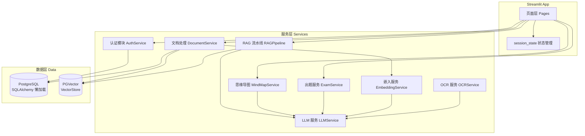

# 技术设计文档：学科学习助手

## 概述

学科学习助手是一个基于 RAG（检索增强生成）技术的 Web 应用，帮助学生和自学者将学习资料向量化后进行智能问答、结构化解题、思维导图生成和 AI 出题。

技术栈：
- 前端/应用框架：Streamlit（单应用入口，多页面通过 `st.navigation` 或侧边栏切换）
- 数据库：Neon PostgreSQL + pgvector 扩展，通过 SQLAlchemy 懒加载连接
- 向量存储：langchain-postgres PGVector，按 subject_id 隔离 collection
- LLM/Embedding：OpenAI 兼容接口（支持硅基流动等第三方服务，base_url 可配置）
- 配置管理：Streamlit Secrets（`.streamlit/secrets.toml`）
- 文件处理：临时存储于 `/tmp`，处理完即删
- OCR：优先使用 LLM 视觉能力，备选 pytesseract
- 思维导图：Mermaid 格式，通过 streamlit-markmap 或 `st.markdown` 渲染

---

## 架构

### 整体架构



### 文件结构

```
app.py                        # Streamlit 入口
config.py                     # 从 st.secrets 读取配置
database.py                   # SQLAlchemy engine 懒加载 + 表定义
services/
  auth_service.py             # 注册、登录、登出
  document_service.py         # 文件解析、分块、向量化
  rag_pipeline.py             # 检索 + LLM 问答/解题
  llm_service.py              # LLM 调用封装
  embedding_service.py        # Embedding 调用封装
  ocr_service.py              # OCR 识别
  mindmap_service.py          # 思维导图生成
  exam_service.py             # 历年题处理 + AI 出题
pages/
  login.py                    # 登录/注册页
  subjects.py                 # 学科管理页
  subject_detail.py           # 学科详情（资料、问答、解题）
  history.py                  # 对话历史页
  mindmap.py                  # 思维导图页
  past_exams.py               # 历年题管理页
  exam_generator.py           # AI 出题/预测试卷页
```

---

## 组件与接口

### 配置模块（config.py）

从 `st.secrets` 读取所有配置，启动时校验必需项：

```python
# 必需配置项
DATABASE_URL          # PostgreSQL 连接串
LLM_API_KEY           # OpenAI 兼容 API Key
LLM_BASE_URL          # API Base URL（如硅基流动）
LLM_CHAT_MODEL        # 对话模型名称
LLM_EMBEDDING_MODEL   # Embedding 模型名称

# 可选配置项（有默认值）
SIMILARITY_THRESHOLD  # 相关性阈值，默认 0.3
CHUNK_SIZE            # 分块大小，默认 1000
CHUNK_OVERLAP         # 分块重叠，默认 200
TOP_K                 # 检索 Top-K，默认 5
```

### 数据库模块（database.py）

使用 SQLAlchemy 懒加载模式，engine 在首次调用 `get_engine()` 时才创建：

```python
_engine = None

def get_engine():
    global _engine
    if _engine is None:
        _engine = create_engine(config.DATABASE_URL, pool_pre_ping=True)
    return _engine

def get_session():
    return sessionmaker(bind=get_engine())()
```

### 认证服务（AuthService）

| 方法 | 签名 | 说明 |
|------|------|------|
| register | `(username, password) -> Result` | bcrypt 加密，写入 users 表 |
| login | `(username, password) -> Result[User]` | 验证密码，写入 session_state |
| logout | `() -> None` | 清除 session_state |
| get_current_user | `() -> Optional[User]` | 从 session_state 读取当前用户 |

### 文档服务（DocumentService）

| 方法 | 签名 | 说明 |
|------|------|------|
| upload_and_process | `(file, subject_id, user_id) -> Result` | 完整上传流程 |
| parse_file | `(tmp_path, filename) -> str` | 解析文件为纯文本 |
| chunk_text | `(text) -> List[str]` | 按 1000/200 分块 |
| vectorize_chunks | `(chunks, doc_id, subject_id) -> Result` | 生成向量并存入 PGVector |
| delete_document | `(doc_id, subject_id) -> Result` | 删除记录和向量 |
| list_documents | `(subject_id) -> List[Document]` | 列出学科资料 |

文件解析器映射：
- `.pdf` → PyPDF2 / pdfplumber（扫描版触发 OCR）
- `.docx` → python-docx
- `.pptx` → python-pptx
- `.txt` / `.md` → 直接读取

### RAG 流水线（RAGPipeline）

```python
def query(question: str, subject_id: int, mode: str = "strict") -> RAGResult:
    # 1. 向量检索 Top-K 文本块
    # 2. 计算相关性得分（cosine similarity）
    # 3. 判断是否低于阈值
    # 4. 若低于阈值，返回 RAGResult(needs_confirmation=True)
    # 5. 否则调用 LLM 生成回答
    # 6. 保存至 conversation_history
```

`RAGResult` 数据类：
```python
@dataclass
class RAGResult:
    answer: str = ""
    sources: List[Source] = field(default_factory=list)
    needs_confirmation: bool = False  # 相关性不足，需用户确认
    top_score: float = 0.0
    mode: str = "strict"  # strict | broad
```

### LLM 服务（LLMService）

封装 OpenAI 兼容客户端，支持 base_url 配置：

```python
def chat(messages: List[dict], **kwargs) -> str
def chat_with_vision(messages: List[dict], image_b64: str) -> str  # OCR 用
def stream_chat(messages: List[dict]) -> Generator[str, None, None]
```

### 嵌入服务（EmbeddingService）

```python
def embed_texts(texts: List[str]) -> List[List[float]]
def embed_query(text: str) -> List[float]
```

### OCR 服务（OCRService）

优先使用 LLM 视觉能力，失败时降级到 pytesseract：

```python
def extract_text(image_path: str) -> str:
    try:
        return self._llm_ocr(image_path)
    except Exception:
        return self._tesseract_ocr(image_path)
```

### 思维导图服务（MindMapService）

```python
def generate(chunks: List[str], subject_name: str) -> str  # 返回 Mermaid/markmap 文本
def render(mermaid_text: str) -> None  # 调用 st.markdown 或 streamlit-markmap 渲染
```

### 出题服务（ExamService）

```python
def generate_predicted_paper(subject_id: int) -> str  # 基于历年题生成预测试卷
def generate_custom_questions(subject_id: int, params: ExamParams) -> str  # 按需出题
def process_past_exam_file(file, subject_id: int) -> Result  # 处理历年题文件
```

---

## 数据模型

### 数据库表结构

```sql
-- 用户表
CREATE TABLE users (
    id          SERIAL PRIMARY KEY,
    username    VARCHAR(64) UNIQUE NOT NULL,
    password_hash VARCHAR(128) NOT NULL,
    created_at  TIMESTAMP DEFAULT NOW()
);

-- 学科表
CREATE TABLE subjects (
    id          SERIAL PRIMARY KEY,
    user_id     INTEGER REFERENCES users(id) ON DELETE CASCADE,
    name        VARCHAR(128) NOT NULL,
    category    VARCHAR(64),
    description TEXT,
    created_at  TIMESTAMP DEFAULT NOW()
);

-- 资料表
CREATE TABLE documents (
    id          SERIAL PRIMARY KEY,
    subject_id  INTEGER REFERENCES subjects(id) ON DELETE CASCADE,
    user_id     INTEGER REFERENCES users(id) ON DELETE CASCADE,
    filename    VARCHAR(256) NOT NULL,
    status      VARCHAR(16) DEFAULT 'pending',  -- pending/processing/completed/failed
    error       TEXT,
    created_at  TIMESTAMP DEFAULT NOW()
);

-- 文本块表（元数据，向量存于 PGVector）
CREATE TABLE chunks (
    id          SERIAL PRIMARY KEY,
    document_id INTEGER REFERENCES documents(id) ON DELETE CASCADE,
    subject_id  INTEGER REFERENCES subjects(id) ON DELETE CASCADE,
    chunk_index INTEGER NOT NULL,
    content     TEXT NOT NULL,
    created_at  TIMESTAMP DEFAULT NOW()
);

-- 会话表
CREATE TABLE conversation_sessions (
    id          SERIAL PRIMARY KEY,
    user_id     INTEGER REFERENCES users(id) ON DELETE CASCADE,
    subject_id  INTEGER REFERENCES subjects(id) ON DELETE SET NULL,
    title       VARCHAR(256),
    session_type VARCHAR(32) DEFAULT 'qa',  -- qa/solve/mindmap/exam
    created_at  TIMESTAMP DEFAULT NOW()
);

-- 对话历史表
CREATE TABLE conversation_history (
    id          SERIAL PRIMARY KEY,
    session_id  INTEGER REFERENCES conversation_sessions(id) ON DELETE CASCADE,
    role        VARCHAR(16) NOT NULL,  -- user/assistant
    content     TEXT NOT NULL,
    sources     JSONB,                 -- 引用来源列表
    scope_choice VARCHAR(16),          -- strict/broad（知识范围选择）
    created_at  TIMESTAMP DEFAULT NOW()
);

-- 历年题文件表
CREATE TABLE past_exam_files (
    id          SERIAL PRIMARY KEY,
    subject_id  INTEGER REFERENCES subjects(id) ON DELETE CASCADE,
    user_id     INTEGER REFERENCES users(id) ON DELETE CASCADE,
    filename    VARCHAR(256) NOT NULL,
    status      VARCHAR(16) DEFAULT 'pending',  -- pending/processing/completed/failed
    error       TEXT,
    created_at  TIMESTAMP DEFAULT NOW()
);

-- 历年题题目表
CREATE TABLE past_exam_questions (
    id              SERIAL PRIMARY KEY,
    exam_file_id    INTEGER REFERENCES past_exam_files(id) ON DELETE CASCADE,
    subject_id      INTEGER REFERENCES subjects(id) ON DELETE CASCADE,
    question_number VARCHAR(16),
    content         TEXT NOT NULL,
    answer          TEXT,
    created_at      TIMESTAMP DEFAULT NOW()
);
```

### PGVector Collection 命名规则

每个学科对应一个独立的 PGVector collection，命名格式：

```
subject_{subject_id}
```

例如：`subject_42` 对应 subject_id=42 的学科。

### session_state 结构

```python
st.session_state = {
    "user": {           # 登录用户信息，None 表示未登录
        "id": int,
        "username": str
    },
    "uploaded_files": set(),   # 已处理文件名集合，防重复上传
    "current_subject_id": int, # 当前选中学科
    "pending_rag_result": RAGResult,  # 待用户确认的 RAG 结果（相关性不足时）
}
```

---

## 正确性属性

*属性（Property）是在系统所有有效执行中都应成立的特征或行为——本质上是对系统应做什么的形式化陈述。属性是人类可读规范与机器可验证正确性保证之间的桥梁。*

### 属性 1：密码哈希不可逆存储

*对于任意* 长度不小于 6 的明文密码，调用注册流程后，存入数据库的 `password_hash` 字段不得等于原始明文，且 `bcrypt.checkpw(plaintext, hash)` 必须返回 `True`。

**验证需求：1.2**

### 属性 2：注册输入验证

*对于任意* 空用户名或长度小于 6 的密码，注册操作必须失败并返回包含具体字段说明的错误信息；对于任意已存在的用户名，第二次注册必须失败并提示"用户名已被占用"。

**验证需求：1.3, 1.4**

### 属性 3：登录验证与状态管理

*对于任意* 有效用户凭据，登录后 `session_state["user"]` 必须包含正确的用户信息；对于任意无效凭据，登录必须失败且 `session_state["user"]` 为 `None`；登出后 `session_state["user"]` 必须被清除。

**验证需求：2.2, 2.3, 2.5**

### 属性 4：登录状态持久性

*对于任意* 已登录用户，在 Streamlit rerun（页面重新执行）后，`session_state["user"]` 中的用户信息必须保持不变，不因 rerun 而丢失。

**验证需求：2.4**

### 属性 5：用户数据隔离

*对于任意* 两个不同用户，用户 A 查询学科列表、资料列表、对话历史时，返回结果中不得包含用户 B 的任何数据；反之亦然。

**验证需求：3.3, 8.1, 10.1**

### 属性 6：文件处理后临时文件清理

*对于任意* 上传的文件，无论处理成功还是失败，处理流程结束后 `/tmp` 目录下对应的临时文件必须不存在。

**验证需求：4.2**

### 属性 7：文本分块规则

*对于任意* 非空文本，分块结果中每个 chunk 的字符长度不超过 1000，且相邻 chunk 之间存在不超过 200 字符的重叠内容。

**验证需求：4.3**

### 属性 8：文档状态一致性

*对于任意* 文档处理流程，`status` 字段必须准确反映处理结果：仅当数据库写入和向量化均成功时置为 `completed`；任一步骤失败时置为 `failed` 并在 `error` 字段记录错误信息。

**验证需求：4.4, 4.5**

### 属性 9：防重复上传

*对于任意* 文件名，在同一 Streamlit session 中第二次上传相同文件名时，必须被 `session_state["uploaded_files"]` 拦截，不触发向量化流程，`chunks` 表中不产生重复记录。

**验证需求：4.7**

### 属性 10：RAG 检索范围隔离

*对于任意* 问答或解题请求，RAG 流水线从 PGVector 检索到的所有文本块必须来自当前学科对应的 collection（`subject_{subject_id}`），不得包含其他学科的文本块。

**验证需求：6.1, 10.2**

### 属性 11：相关性阈值判断

*对于任意* RAG 检索结果，当所有返回文本块的 cosine similarity 得分均低于预设阈值时，系统必须设置 `needs_confirmation=True` 并停止 LLM 调用；当至少一个文本块得分高于阈值时，系统可正常调用 LLM。

**验证需求：11.1, 11.2**

### 属性 12：对话历史完整保存

*对于任意* 完成的问答或解题请求，`conversation_history` 表中必须存在对应记录，包含问题内容、回答内容、来源引用，以及用户的知识范围选择（`scope_choice` 字段）。

**验证需求：6.5, 11.8**

### 属性 13：历年题数据表隔离

*对于任意* 历年题文件的处理流程，其文件记录必须写入 `past_exam_files` 表，题目记录必须写入 `past_exam_questions` 表，不得向 `documents` 或 `chunks` 表写入任何记录。

**验证需求：13.4**

### 属性 14：级联删除完整性

*对于任意* 学科删除操作，删除完成后该学科下的所有关联记录（documents、chunks、conversation_sessions、conversation_history、past_exam_files、past_exam_questions）必须全部不存在于数据库中。

**验证需求：3.4**

### 属性 15：未登录访问拦截

*对于任意* 未登录状态下的资料上传、问答、解题或历史查询请求，系统必须拒绝执行并跳转至登录页，不返回任何用户数据。

**验证需求：10.3**

### 属性 16：配置缺失错误提示

*对于任意* 缺失的必需配置项（DATABASE_URL、LLM_API_KEY 等），系统在初始化时必须显示包含该配置键名的明确错误信息，并终止初始化流程。

**验证需求：9.3**

---

## 错误处理

### 错误分类与处理策略

| 错误类型 | 处理方式 | 用户提示 |
|----------|----------|----------|
| 配置项缺失 | 启动时终止，`st.error` 显示缺失项 | 明确列出缺失的配置键名 |
| 数据库连接失败 | 捕获异常，`st.error` 显示 | "数据库连接失败，请稍后重试" |
| 文件解析失败 | 更新 status=failed，记录 error | 显示具体错误信息 |
| 向量化失败 | 更新 status=failed，记录 error | 显示具体错误信息 |
| LLM 调用失败 | 捕获异常，不保存历史 | "AI 服务暂时不可用，请稍后重试" |
| OCR 失败（LLM） | 降级到 pytesseract | 静默降级，记录日志 |
| OCR 失败（全部） | 更新 status=failed | 显示 OCR 失败提示 |
| 未登录访问 | 重定向到登录页 | 无（直接跳转） |
| 删除操作失败 | 事务回滚，保持数据不变 | 显示错误信息 |
| 无可用资料 | 不调用 LLM | "该学科暂无可用资料，请先上传学习材料" |

### 文件处理错误保障

文件处理使用 `try/finally` 确保临时文件始终被清理：

```python
tmp_path = f"/tmp/{uuid4()}_{filename}"
try:
    # 保存、解析、向量化
    ...
except Exception as e:
    update_document_status(doc_id, "failed", str(e))
finally:
    if os.path.exists(tmp_path):
        os.remove(tmp_path)
```

---

## 测试策略

### 双轨测试方法

采用单元测试和基于属性的测试（PBT）相结合的方式：

- **单元测试**：验证具体示例、边界条件和错误处理
- **属性测试**：通过随机输入验证普遍性属性，每个属性测试最少运行 100 次迭代

Python 属性测试库：**Hypothesis**

### 单元测试重点

- 认证流程：注册成功/失败、登录成功/失败、登出
- 文件解析：各格式（PDF/DOCX/PPTX/TXT/MD）的解析正确性
- 分块逻辑：边界条件（空文本、超长文本、恰好整除）
- 相关性阈值判断：高于/低于阈值的分支
- 级联删除：学科删除后关联数据清理
- 配置校验：缺失必需项时的错误提示

### 属性测试配置

每个属性测试必须引用设计文档中对应的属性编号，标注格式：

```python
# Feature: subject-learning-assistant, Property {N}: {property_text}
@given(...)
@settings(max_examples=100)
def test_property_N_xxx():
    ...
```

### 属性测试映射

| 设计属性 | 测试方法 | Hypothesis 策略 |
|----------|----------|-----------------|
| 属性 1：密码哈希 | `test_property_1_password_hash` | `st.text(min_size=6)` |
| 属性 2：注册输入验证 | `test_property_2_registration_validation` | `st.text()` 生成各类用户名/密码 |
| 属性 3：登录验证与状态管理 | `test_property_3_login_state` | `st.text()` 生成凭据 |
| 属性 4：登录状态持久性 | `test_property_4_session_persistence` | `st.integers()` 生成用户 ID |
| 属性 5：用户数据隔离 | `test_property_5_user_data_isolation` | `st.integers()` 生成多用户 |
| 属性 6：临时文件清理 | `test_property_6_tmp_cleanup` | `st.binary()` 模拟文件内容 |
| 属性 7：文本分块规则 | `test_property_7_chunk_rules` | `st.text(min_size=1)` |
| 属性 8：文档状态一致性 | `test_property_8_document_status` | `st.booleans()` 模拟成功/失败 |
| 属性 9：防重复上传 | `test_property_9_dedup_upload` | `st.text()` 生成文件名 |
| 属性 10：RAG 检索隔离 | `test_property_10_rag_isolation` | `st.integers()` 生成 subject_id |
| 属性 11：相关性阈值判断 | `test_property_11_similarity_threshold` | `st.floats(0.0, 1.0)` |
| 属性 12：对话历史完整保存 | `test_property_12_history_saved` | `st.sampled_from(["strict","broad"])` |
| 属性 13：历年题数据表隔离 | `test_property_13_exam_table_isolation` | `st.binary()` 模拟文件 |
| 属性 14：级联删除完整性 | `test_property_14_cascade_delete` | `st.integers()` 生成学科 |
| 属性 15：未登录访问拦截 | `test_property_15_unauthenticated_access` | `st.sampled_from(actions)` |
| 属性 16：配置缺失错误提示 | `test_property_16_missing_config` | `st.sampled_from(required_keys)` |
